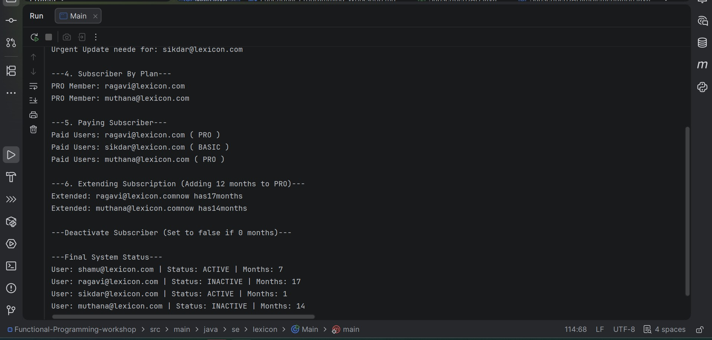

# Workshop: Functional Programming - Subscription Management

## Project Overview
This project is a subscription list management system built using **Java Functional Programming** concepts. The goal was to translate a UML class diagram into working code using functional interfaces, lambdas, and the DAO (Data Access Object) pattern.

## Features & Implementation
- **Core Models:** Implemented `Subscriber` class with a `Plan` enumeration (FREE, BASIC, PRO).
- **Functional Interfaces:** Custom interfaces `SubscriberFilter` and `SubscriberAction` to allow flexible business logic.
- **Data Access:** `SubscriberDAO` implementation using an internal list to simulate a database.
- **Processing Engine:** A `SubscriberProcessor` that handles bulk filtering and data updates using Lambdas.

## Business Rules Applied
1. **Filtering:** Identified active users, expiring accounts, and users filtered by specific plans.
2. **Bulk Actions:** 
   - **Extension:** Automatically added 12 months to PRO/BASIC subscribers.
   - **Deactivation:** Automatically deactivated users with 0 months remaining.

## Execution Output
Below is the screenshot of the system processing the subscriber data based on the implemented rules:

 

## How to Run
1. Clone the repository.
2. Navigate to `src/se/lexicon/Main.java`.
3. Run the `main` method to see the processor in action.
